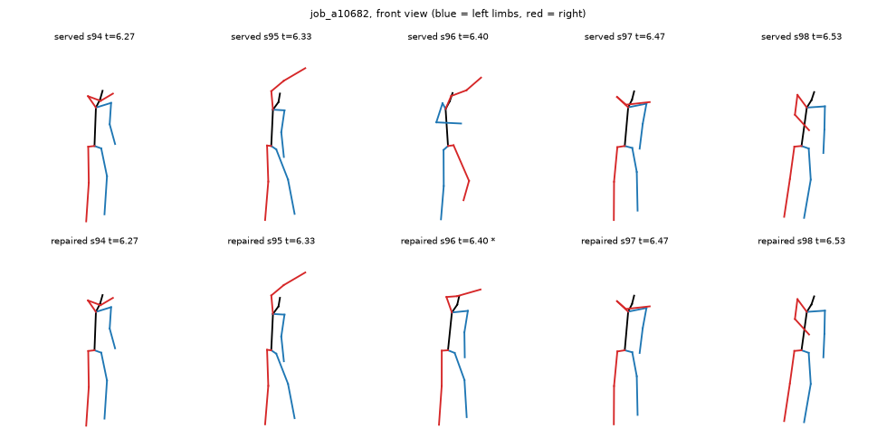

# Orientation flips: the body that turns round for one frame

Owner report: on lesson `hoodie-followcam` (a YouTube short: a
girl in a full hoodie dancing in the rain in a parking lot at night, follow-cam),
"for a few frames the whole 3D mesh changes completely or turns around". The ask
was to correct those frames, not remove them.

This is research plus a prototype fix on branch `research/orientation-flips`.
Nothing was deployed, no live lesson was re-processed, and no GPU was used. Every
number below comes from outputs that were already stored.

**Sources.** The served MotionResults of six lessons (`/api/jobs/{job}/result`),
put back into world joint positions with forward kinematics (local rotations plus
`joint_hierarchy.rest_translation`). The two npz files still on the
`stepwise-results` Volume (`dc32a0…`, `7995c9…`). The other four were swept,
including a10682's. The a10682 source video, cut at the pipeline's 15 fps. The
lesson itself in the Claude browser, stepped sample by sample.

---

## 1. What happens, and how often

**job_a10682 has one flip sample: sample 96, at t = 6.40 s.** Here is what it
does:

| | s95 (6.33 s) | **s96 (6.40 s)** | s97 (6.47 s) |
|---|---|---|---|
| Root yaw (world) | 55° | **131°** | 11° |
| Facing from hips and shoulders | 56° | **114°** | 26° |

- The root rotation is **100° off the path between its two neighbours**, and those
  neighbours are only 43° apart. It steps 79° out and 122° back, where the median
  step in this clip is 8°.
- **The legs come back swapped left for right.** At s96, the left leg sits
  0.31 m from where the left leg was one sample earlier, but only 0.12 m from
  where the right leg was.
- In the video she is in profile with one arm over her hooded head, and she does
  not turn. In the lesson's Front view the mesh swings to show its back for that
  frame and snaps back. The GLB interpolates linearly between samples, so the
  swing is spread across about 130 ms, which reads as a twitch-and-turn.

Two other spots in this clip look alarming in the numbers, but the video shows
they are real motion, so the fix must leave them alone:

- **3.07–4.07 s: a real 360° turn.** The yaw walks 0 → −166 → 167 → 10 at up to
  41° per sample. She turns her back to the camera and comes round.
- **2.2–2.6 s: a real high kick.** Root steps of 22–34°, and a leg straight up
  beside the head. The mesh matches the video.

**Across the other five lessons there are no flips.** That is 2,313 samples,
checked for root detours at spans of 1–4 samples, facing jumps, and left/right
limb swaps:

| Lesson | Samples | Largest short-span root detour | Left/right swaps |
|---|---|---|---|
| a10682 | 196 | **100° (s96)** | **1 (s96)** |
| 5716ec | 715 | < 25° | 0 |
| 345b74 | 531 | ~40° (a 4-sample span at 17.13 s, not a flip) | 0 |
| b82232 | 216 | < 25° | 0 |
| dc32a0 | 671 | < 25° | 0 |
| 7995c9 | 180 | < 25° | 0 |

So this is rare. It is 1 sample in 2,509, and it appeared on the one clip whose
silhouette has no facing cue: hood up, dark clothes, back-lit, at night. It is
SAM 3D Body's front/back ambiguity, which shows up as a partial turn plus a
left/right mirror. It is not a clean 180°: the root lands 100° off, not 180°.

## 2. Where it should be fixed, and what the pipeline does today

- **What ships has no temporal consistency on global orientation.** Both
  consumers read the raw per-frame estimate `per_frame[i][track]["skel_state"]`:
  - `modal_app.export_clip_gltf`, which builds the GLB the mesh plays from;
  - `motion_result.build_motion_result`, which builds the served document.

  The W9 smoother (`tools/smoothing.py`, with a Kalman filter per joint axis) runs
  and is saved into the npz as `smoothed`, but nothing reads it back. The flip
  therefore reaches the learner exactly as the estimator produced it.
- **The smoother would not fix it either, and a longer flip makes it worse.** I
  ran `smooth_track` on a synthetic turning body with a mirror-flip inserted:
  - A 1- or 2-sample flip is caught. The lever-arm speed gate refuses the update
    and holds the previous pose, with a root error of 2–8°, marked `uncertain`.
  - A 3-sample flip gets through. The filter locks onto the flipped orientation
    and stays about 130° wrong for the three correct samples that follow.

  It filters in tangent space, so it never averages quaternion components. The
  problem is that it has no notion of "went away and came back".
- **The right place is a temporal step that edits `per_frame` itself.** It runs
  after the bone-length constraint and before smoothing in
  `process_clip.py`, so the GLB, the MotionResult and the smoother all see the
  corrected pose. The function lives in `tools/smoothing.py`, next to the rest of
  the temporal cleanup.

## 3. The fix (prototype on this branch)

`smoothing.find_orientation_detours` / `repair_orientation_detours` /
`repair_clip_orientation`:

1. **Detect.** Look for a span of observed samples no longer than **0.2 s**
   (3 samples at 15 fps) where two things hold:
   - at every sample of the span, the root's world rotation is more than **60°**
     off the slerp between the observed samples on either side;
   - those two neighbours are closer to each other than half that detour, so the
     body came back.

   Shortest spans are tried first, so one bad sample is never widened into its
   neighbours. A real turn or spin moves *along* the path between its neighbours,
   so it never trips this. A fast spin also fails the "came back" test. The 60°
   threshold sits between the measured flip (100°) and the worst non-flip (~40°).
2. **Correct.** Replace the span's whole pose with the interpolation between those
   neighbours: slerp for every joint's local rotation, lerp for bone offsets and
   scales. This also fixes the left/right leg swap, because the limbs come from
   the neighbours and not from the mirrored frame. Unflagged samples are
   byte-identical.
3. **Stay honest.** The estimate is kept as `skel_state_raw` and the sample gets
   `orientation_repaired: True`. `motion_result.py` then serves it the way a gap
   is served:
   - provenance `observed: false, interpolated: true, suppressed: "low_confidence"`;
   - visibility `uncertain`, which the viewer renders desaturated for that sample;
   - the root_trajectory sample is also not `observed`.

**What was considered and rejected.**
- **Mirror-correcting the frame** (180° yaw plus a left/right swap): the real flip
  lands 100° off, not 180°, so "undo the mirror" would not recover a true pose.
- **Using the 2D detector's shoulder order as a tie-breaker:** RTMO sees the same
  hood with the same ambiguity. The stored `detections.json` is also 5 fps, too
  coarse to check against.

Both stay open (see `ponytail:` in the code) for flips longer than 0.2 s, which
this rule deliberately leaves alone: with no "came back", there is no local
evidence for which side is wrong.

## 4. Evaluation

I ran the detector and repair on the served poses of all six lessons, and on the
two surviving npz files through `repair_clip_orientation` exactly as
`process_clip` calls it.

| Lesson | Samples repaired | Max root step between samples | p99 root step | Max facing jump |
|---|---|---|---|---|
| **a10682** | **1 (s96, 6.40 s)** | **122° → 41°** (41° is the real turn) | 44° → 34° | **88° → 41°** |
| 5716ec | 0 | 35° → 35° | 28° → 28° | 54° → 54° |
| 345b74 | 0 | 44° → 44° | 30° → 30° | 54° → 54° |
| b82232 | 0 | 26° → 26° | 24° → 24° | 29° → 29° |
| dc32a0 (and its npz) | 0 | 39° → 39° | 33° → 33° | 43° → 43° |
| 7995c9 (and its npz) | 0 | 18° → 18° | 17° → 17° | 21° → 21° |

On every lesson, the samples that were not flagged are byte-identical before and
after. The before/after figure above shows s96 back in line with its neighbours,
with the left leg on the left again.

**Tests:**
- `tools/test_smoothing.py`, 4 new:
  - 1- and 2-sample mirror-flips inside a turning body are found and fixed, and
    everything else is byte-identical;
  - real turns at 12, 40 and 70° per sample are left alone;
  - a flip next to a gap is not guessed at;
  - `repair_clip_orientation` keeps the raw estimate and flags the sample.
- `test_world_placement_wiring.py`, 1 new: a repaired sample is served as
  interpolated / `uncertain` and never `observed`.
- The full cv-tools suite passes (52), as do the motion-api rotation and placement
  tests.

## 5. Applying it to existing lessons

- **Future lessons:** every lesson processed after this merges gets the repair
  automatically. It is CPU-only and took 0.11 s on the 45 s dc32a0 clip (671 samples).
- **job_a10682, the only affected lesson:** its npz has been swept, so the only
  route is a **full re-run** of the job. Its measured cost was **$0.067** at
  2.7 fps. That is about 1.5 minutes of GPU for 13 s of video, plus the usual
  fixed start-up overhead. Re-running also refreshes the GLB and MotionResult
  under the same job id.
- **Lessons whose npz still exists:** an **export-only re-run** is possible with
  no GPU:
  1. load the npz;
  2. run `repair_clip_orientation`;
  3. save it back;
  4. run `modal_app.export_clip_gltf`, which rebuilds the GLB and the
     MotionResult.

  Today that would change nothing: the two surviving npz files (dc32a0, 7995c9)
  have zero flips. The three swept lessons without flips (5716ec, 345b74, b82232)
  need nothing.
- **A zero-GPU alternative for a10682:** patch the served artifacts directly,
  meaning sample 96 of the MotionResult's rotations and the GLB's animation
  channels. That is possible but not built. It would be a one-off editor for two
  artifacts that a $0.07 re-run regenerates properly.

## 6. Open

- **Flips longer than 0.2 s are not repaired.** None were seen in 2,509 samples.
  If one turns up, the next step is a 2D tie-breaker from the detector's shoulder
  and hip order or its face keypoints, with RTMO's own hood reliability measured
  first.
- **Visible side effect:** a repaired sample renders `uncertain` (desaturated) for
  one 67 ms sample. That is honest, and far less jarring than the turn-around it
  replaces.
- **The W9 smoother's output is still unused**, and it mishandles a 3-sample flip
  (§2). If it is ever wired into export, it should run after this repair, which
  is where this branch puts it.
